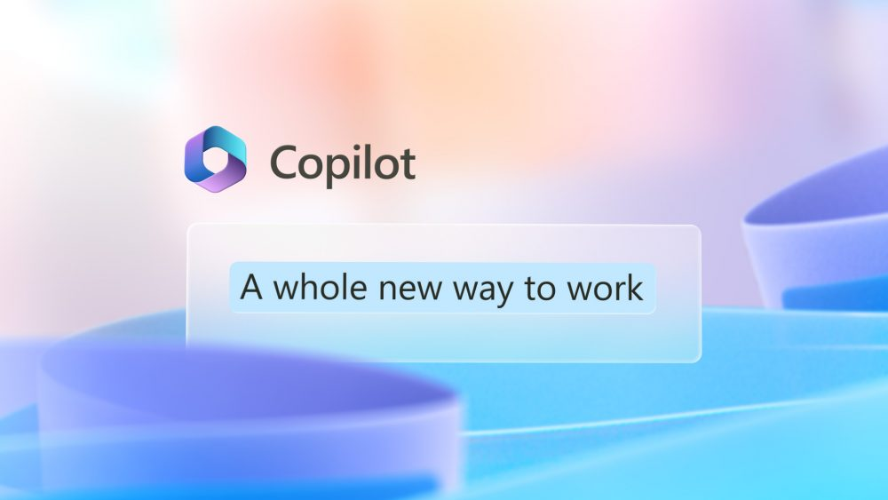

# ai-case-study

 Case study on Microsoft Copilot feature that was introduced in Mar 2023 and available for preview for users in September 2023. This case study is to show case how the Copilot feature uses Artificial Intelligence, what are its capabilities? how it helps business users and developers? what is the future for Microsoft and Copilot? 

# Microsoft Copilot
Microsoft introduced Copilot as new feature in 2023 for all Microsoft 365 (previously known as Office 365) and PowerPlatform Apps. It is a Generative AI tool that assists in completing the tasks or providing suggestions in their apps using NLP (Natural Language Processing).

You can read more here [Microsoft introduction to Copilot published Mar 16, 2023](https://blogs.microsoft.com/blog/2023/03/16/introducing-microsoft-365-copilot-your-copilot-for-work/)

## Overview and Origin

* Microsoft, the company which don't an introduction to anyone. It is a company known to almost everyone on the planet at least one of the products developed by them will be used in every business, company or house. Windows, MS Office (Word, Excel, PowePoint), Internet Explorer, Outlook, OneDrive, Skype, Teams Chat, Azure, XBox, Surface and so on the list goes on. The company has always catching up with trends and innovating in technology. 
Their new ***Copilot feature that was introduced earlier this year is going to be a trend setting across business applications and we will discuss more about it in this case study***.

* Microsoft has been investing and researching on AI from long time. They have introduced few features that were not so successful. But have dedicated to make products more innovative, and see how to help both users and developers. Below are some of their Generative AI features introduced from 2019 until today with Copilot. 

<small>Source: [PowerPlatform AI Journey](https://cloudblogs.microsoft.com/powerplatform/2023/03/16/power-platform-is-leading-a-new-era-of-ai-generated-low-code-app-development/)</small>

* OpenAI ChatGPT opened up AI concept to every human, people were amazed and at the same time scared about what AI can do. The whole ***Generative AI, NLP, and Large Language Models (LLMs)*** concepts started to trend and every technology company started to invest more and more to introduce it in one shape or form in their products. Microsoft is no exception to that, and with their already AI products and research they built this ***copilot which uses your data to build LLMs assuring that it is safe and secure.*** Promoting as feature that increases productivity and reduce errors for Microsoft 365 products (previously known as Office 365) and increasing development time making it faster with suggestions and coding templates in all their Power Platform products. Let's dive more in details and see how copilot works. 

Read more: [M365 Copilot for work](https://blogs.microsoft.com/blog/2023/03/16/introducing-microsoft-365-copilot-your-copilot-for-work/)

## What is Copilot?

Copilot is targeting both end users and developers. Everything related to M365 is to increase productivity of end users who use M365 applications on day to day basis like Word, Excel, Outlook, Teams chat and so on. ***They call it reInvent Productivity.*** It accepts you natural words to create content, analyze data in excel, suggest meetings/to do/actions from teams meetings, write your emails, and so on. Eveything is based on the your company data stored in your tenant. 

<small>Excel with Copilot</small>
 

<small>Outlook with Copilot</small>
 

You can view more demos/videos related to all M365 apps [here](https://news.microsoft.com/reinventing-productivity/)

For Developers Copilot is embedded in all of the Power Platform applications which is the application suite from Microsoft. They call it AI-first development. It consists of Power Apps, Virtual Agents, Power Automate and Power Pages. Copilot is to make development faster by providing suggestions and creating code using NLP. It reads data and analyzes your process and writes code or suggests better approach. It can create UI forms using your data models, adds new columns, create tables, create new flows, can be chatbot using virtual agents, and so on.

Here is a brief video about Copilot in Power Apps. 

<video src="https://wus-streaming-video-rt-microsoft-com.akamaized.net/2cb38883-7870-4dec-8e16-25d48c0e662f/b7e311e6-3a72-41ce-882c-b5800895_6750.mp4"></video>
<small>Source: [Copilot in Power Apps](https://powerapps.microsoft.com/en-us/blog/announcing-a-next-generation-ai-copilot-in-microsoft-power-apps-that-will-transform-low-code-development/)</small>

Another major application from Microsoft Dynamics 365 is also introduced with Copilot. And Microsoft tells it is the first CRM and ERP application that uses Generative AI to enhance and increase productivity with less effort. Read more on Dynamics 365 Copilot [here](https://blogs.microsoft.com/blog/2023/03/06/introducing-microsoft-dynamics-365-copilot/).

Based on Microsoft's market across M365 apps, Power Platform and Dynamics 365 it will be a huge financial and technological achievement once this Copilot reaches every customer. 

## How does Copilot works?

Copilot is built on Large Language Models (LLMs) hosted in Microsoft cloud. All of these models are trained using every publicly available resources. And these models use the your prompts and context to generate reponses. The more interaction you do, the more knowledgable Copilot becomes. Microsoft Graph (which contains every details about your data, its relationships, and activities happening across your organization) is the major data source for copilot and helps to provide responses related to data you provided access to. 

Here is video on how Copilot works

<video src="https://www.youtube.com/watch?v=B2-8wrF9Okc"></video>

<small>[Read more on How Copilot works](https://techcommunity.microsoft.com/t5/microsoft-mechanics-blog/how-microsoft-365-copilot-works/ba-p/3822755)</small>

Microsoft's office application suite is and Google's G Suite covers almost 50% of the usage across globe. So, it is a major contribution to their portfolio and has great financial boost based on how well the product works. 

* Who is the company's intended customer? Is there any information about the market size of this set of customers?
* Microsoft created this feature for everyone who uses M365 applications for collaboration and increase productivity. 
* And for PowerPlatform application developers and creators, help them to increase productivity by suggesting the code, and helping them identify processes across their organization, create a pattern for citizen developers and so on.
* 
[https://www.statista.com/statistics/983321/worldwide-office-365-user-numbers-by-country/#:\~:text=Office%20365%20is%20used%20by,related%20services%20to%20its%20subscribers.]

[https://msdynamicsworld.com/story/highlights-microsoft-2023-q3-earnings-power-platform-growth-profiting-ai-new-revenue-guidance]

* What solution does this company offer that their competitors do not or cannot offer? (What is the unfair advantage they utilize?)

After OpenAI ChatGPT emerged every technology started to embed the generative AI in some shape or form into their portfolio. And Microsoft is also doing the same on their widely used applications both end users applications like M365 office tools and development community using PowerPlatform applications. 

We have Duet AI from Google which is a competitive feature to Microsoft’s  M365 Copilot. Both Google’s G Suite and Microsoft’s M365 share the market on office applications, google has upper hand and their Duet AI is little ahead of Copilot. Google Duet AI is more innovative for the content creators and Microsoft Copilot is mostly used for business users using office applications. 

But Microsoft’s Power Platform Copilot is something new to developers and creators, who are already getting wide assistance from ChatGPT. The Copilot helps to develop business applications more faster and efficiently. As per Microsoft, Copilot is the first generative AI capability used in any of the CRM or ERP applications. [https://blogs.microsoft.com/blog/2023/03/06/introducing-microsoft-dynamics-365-copilot/]

* Which technologies are they currently using, and how are they implementing them? (This may take a little bit of sleuthing&mdash;you may want to search the company’s engineering blog or use sites like Stackshare to find this information.)

[https://techcommunity.microsoft.com/t5/microsoft-mechanics-blog/how-microsoft-365-copilot-works/ba-p/3822755]

###Microsoft Copilot Mechanics
[https://www.youtube.com/watch?v=B2-8wrF9Okc]

Add gifs or videos with demos. 

## Landscape

* What field is the company in?
* Microsoft is in business applications and has major share across the globe.

* What have been the major trends and innovations of this field over the last 5&ndash;10 years?
* Microsoft has been the leader of operating system Windows from decades, and then the Office applications were introduced which is ruling the businesses and companies. 
* 
* What are the other major companies in this field?
	Google, Salesforce, Outsystems, 
* [https://www.gartner.com/reviews/market/multiexperience-development-platforms/vendor/microsoft/product/powerapps/alternatives]

## Results

* What has been the business impact of this company so far?

* What are some of the core metrics that companies in this field use to measure success? How is your company performing based on these metrics?

* How is your company performing relative to competitors in the same field?

## Recommendations

* If you were to advise the company, what products or services would you suggest they offer? (This could be something that a competitor offers, or use your imagination!)

With Microsoft being one of the top companies both financially and innovative, I want them to invest more in research with quantum computing using AI applications. It will help to go way ahead with the medical field and climate exploration. 

* Why do you think that offering this product or service would benefit the company?
Both Medical and Climate (environmental) studies require more studies and predictions.  The combination of AI and quantum computing will make this research faster and help to provide better medical treatments and get prepared for natural calamities. 

* What technologies would this additional product or service utilize?
Quantum Computing and AI. 

* Why are these technologies appropriate for your solution?
* Many AI applications, such as planning and scheduling, can benefit from quantum computing because it helps explore viable solutions to problems. AI architectures can be developed more efficiently and at a larger scale using quantum computers.
[https://www.einfochips.com/blog/quantum-computing-in-artificial-intelligence-around-the-corner/#:\~:text=Many%20AI%20applications%2C%20such%20as,larger%20scale%20using%20quantum%20computers.]