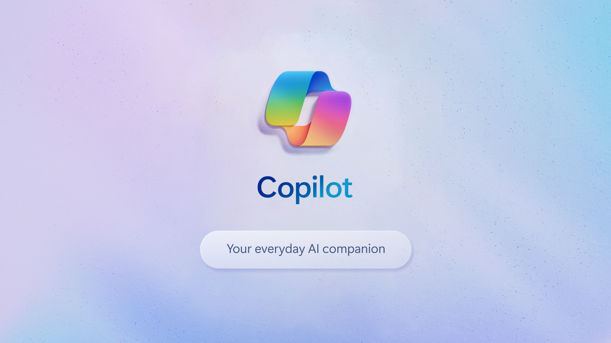
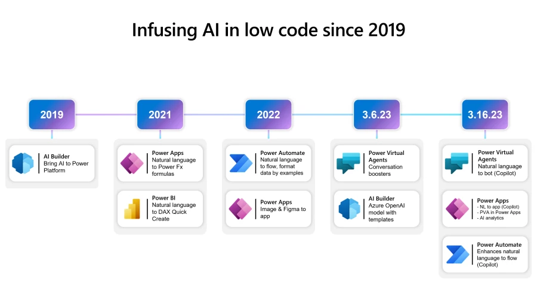
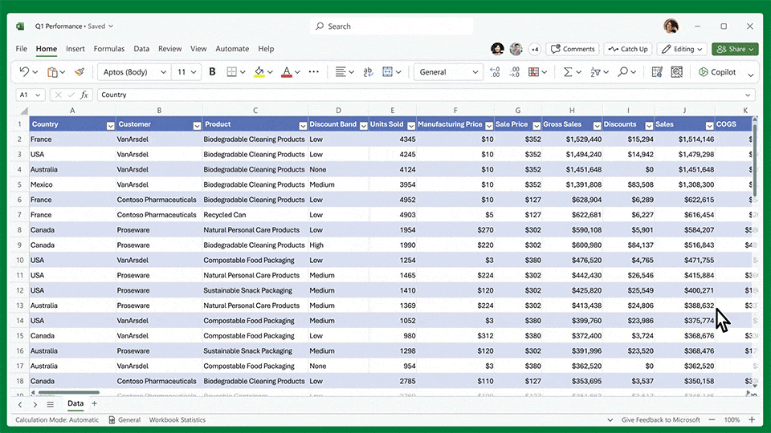
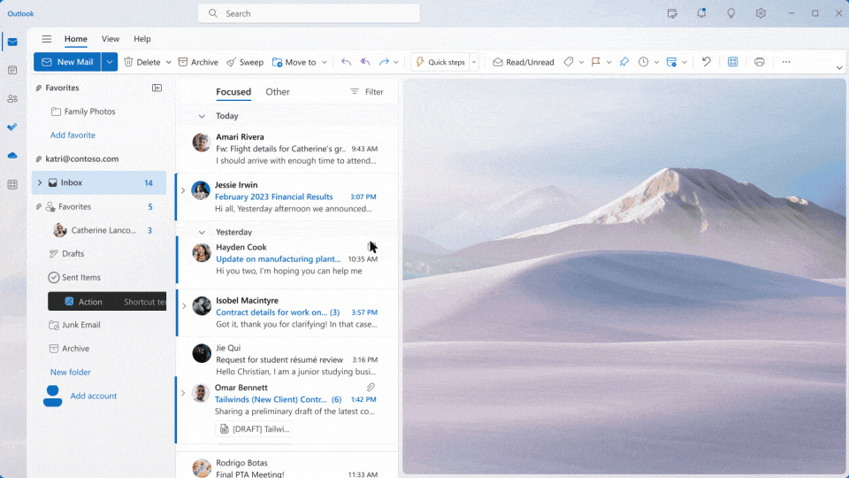
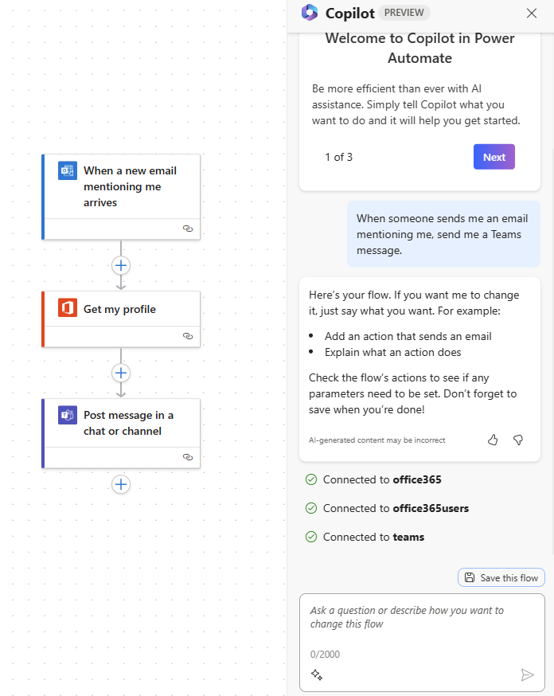

# ai-case-study

 Case study on Microsoft Copilot feature that was introduced in Mar 2023 and available for preview for users in September 2023. This case study is to show case how the Copilot feature uses Artificial Intelligence, what are its capabilities? how it helps business users and developers? what is the future for Microsoft and Copilot? 

# Microsoft Copilot

Microsoft anounced :loudspeaker: Copilot as new feature in 2023 for all Microsoft 365 (previously known as Office 365) and PowerPlatform Apps. It is a Generative AI tool that assists in completing the tasks or providing suggestions in their apps using NLP (Natural Language Processing).

You can read more here [Microsoft introduction to Copilot published Mar 16, 2023](https://blogs.microsoft.com/blog/2023/03/16/introducing-microsoft-365-copilot-your-copilot-for-work/)

## Overview and Origin {#origin-id} :scroll:

* Microsoft, the company which doesn't need an introduction. It is a company known to almost everyone on the planet at least one of the products developed by them will be used in every business, company or house. Windows, MS Office (Word, Excel, PowePoint), Internet Explorer, Outlook, OneDrive, Skype, Teams Chat, Azure, XBox, Surface and so on the list goes on. The company has always catching up with trends and innovating in technology. 
Their new ***Copilot feature that was introduced earlier this year is going to be a trend setting across business applications and we will discuss more about it in this case study***.

* Microsoft has been investing and researching on AI from long time. They have introduced few features that were not so successful. But have dedicated to make products more innovative, and see how to help both users and developers. Below are some of their Generative AI features introduced from 2019 until today with Copilot. 

<small>Source: [PowerPlatform AI Journey](https://cloudblogs.microsoft.com/powerplatform/2023/03/16/power-platform-is-leading-a-new-era-of-ai-generated-low-code-app-development/)</small>

* OpenAI ChatGPT opened up AI concept to every human, people were amazed and at the same time scared about what AI can do. The whole ***Generative AI, NLP, and Large Language Models (LLMs)*** concepts started to trend and every technology company started to invest more and more to introduce it in one shape or form in their products. Microsoft is no exception to that, and with their already AI products and research they built this ***copilot is a next-gen AI assistnant which uses generative AI with Natural Langauage Processing to process your requests.*** Promoting as feature that increases productivity and reduce errors for Microsoft 365 products (previously known as Office 365) and making development faster with suggestions and coding templates in all their Power Platform products. Let's dive more in details and see how copilot works. 

:arrows_clockwise: [ChatGPT vs. Microsoft 365 Copilot: What's the difference?](https://support.microsoft.com/en-us/topic/chatgpt-vs-microsoft-365-copilot-what-s-the-difference-8fdec864-72b1-46e1-afcb-8c12280d712f)

## What is Copilot? :question: 

***Copilot uses Large Language Models (LLMs) with your data in the Microsoft Graph and the Microsoft 365 apps to turn natural words into the most powerful productivity and assistant tool.***

Copilot is targeting both end users and developers. Everything related to M365 is to increase productivity of end users who use M365 applications on day to day basis like Word, Excel, Outlook, Teams chat and so on. ***They call it reInvent Productivity.*** It accepts you natural words to create content, analyze data in excel, suggest meetings/to do/actions from teams meetings, write your emails, and so on. Eveything is based on the your company data stored in your tenant.

Read more: [M365 Copilot for work](https://blogs.microsoft.com/blog/2023/03/16/introducing-microsoft-365-copilot-your-copilot-for-work/)

#### Sample Use Case
Consider you have an Expense Report in an Excel Worksheet and you have 2 tasks to do. One to get the top 2 expense types and other one which month was more expensive. To complete these tasks below are steps using manual vs copilot. 

Task 1: Top 2 Expense Type

| Manual                                             | Copilot                                                               |
| -------------------------------------------------- | --------------------------------------------------------------------- |
| Group the rows in worksheet by column expense type | Ask Copilot “What are the top 2 expense types based on amount spent?” |
| Add a formula to sum all the amounts for each type |                                                                       |
| Sort the worksheet by Group Amount                 |                                                                       |
| Pick top 2 rows as expensive types                 |                                                                       |
|                                                    |                                                                       |

Task 2: Top expensive month

| Manual                                                             | Copilot                                                  |
| ------------------------------------------------------------------ | -------------------------------------------------------- |
| Group the rows in worksheet by column date (by month) column  type | Ask Copilot “Which month of the year had more expenses?” |
| Add a formula to sum all the amounts for each month                |                                                          |
| Sort the worksheet by Group Amount                                 |                                                          |
| Pick top rows as expensive month                                   |                                                          |
|                                                                    |                                                          |

<small>Excel with Copilot</small>
 

<small>Outlook with Copilot</small>
 

You can view more demos/videos related to all M365 apps [here](https://news.microsoft.com/reinventing-productivity/)

For Developers Copilot is embedded in all of the Power Platform applications which is the application suite from Microsoft. ***They call it AI-first development.*** It consists of Power Apps, Virtual Agents, Power Automate and Power Pages. Copilot is to make development faster by providing suggestions and creating code using NLP. It reads data and analyzes your process and writes code or suggests better approach. It can create UI forms using your data models, adds new columns, create tables, create new flows, can be chatbot using virtual agents, and so on.

#### Sample Use Case
Consider you need to be notified when a new user is added to Users Table. 

*To create an Power Automate (flow), it will take about 30 mins but with Copilot you can just ask "Create a flow get an email notification when an User is created in Users Table" and we will see options with the code in few seconds. We can optimize it , customize it as needed.* And this is for simple flow as the complexity increases the development time will be increasing but with Copilot that will exponentially reducing. 

Here is a screen shot on how Copilot created a simple flow to send a message in teams chat when a email is sent to specific user. We just needed few words to create this flow. <small>Source: [Power Automate Copilot](https://learn.microsoft.com/en-us/power-automate/get-started-with-copilot)</small>

Here is a brief :tv: [video](https://wus-streaming-video-rt-microsoft-com.akamaized.net/2cb38883-7870-4dec-8e16-25d48c0e662f/b7e311e6-3a72-41ce-882c-b5800895_6750.mp4) about Copilot in Power Apps. 

<small>Source: [Copilot in Power Apps](https://powerapps.microsoft.com/en-us/blog/announcing-a-next-generation-ai-copilot-in-microsoft-power-apps-that-will-transform-low-code-development/)</small>

Another major application from Microsoft: Dynamics 365 is also introduced with Copilot. And Microsoft tells it is the **first CRM and ERP application that uses Generative AI** to enhance and increase productivity with less effort. Read more on Dynamics 365 Copilot [here](https://blogs.microsoft.com/blog/2023/03/06/introducing-microsoft-dynamics-365-copilot/).

Based on Microsoft's market across M365 apps, Power Platform and Dynamics 365 it will be a huge financial and technological achievement once this Copilot reaches every customer. 

## How does Copilot works? :eyes:

Satya Nadella :speech_balloon: tweeted this on March 16, 

>"With Microsoft 365 Copilot, we're giving people more agency and making technology more accessible with advanced AI and the most universal user interface: natural language."

Copilot is built on *Large Language Models (LLMs)* hosted in Microsoft cloud. All of these models are trained using every publicly available resources. And these models use the your prompts and context to generate reponses. The more interaction you do, the more knowledgable Copilot becomes. Microsoft Graph (which contains every details about your data, its relationships, and activities happening across your organization) is the major data source for copilot and helps to provide responses related to data you provided access to. 

If you want a recap on ChatGPT and Microsoft AI journey go to [top :point_up:](#overview-and-origin-origin-id)

Watch this video :movie_camera: to understnad more on [How Copilot works?](https://www.youtube.com/watch?v=B2-8wrF9Okc)

You can read more in detail on [How Copilot works?](https://techcommunity.microsoft.com/t5/microsoft-mechanics-blog/how-microsoft-365-copilot-works/ba-p/3822755)

## Financial Impact and future

Copilot is almost new and customers are still using in preview mode, so we need to see how it will be adopted and how secured it will be for companies to use considering data is going to be a huge part of it. But so far it is showing a promising future for Copilot and Microsoft. 

Based on current customer base for M365, Power Platform and Dynamics 365 applications it will be a huge positive impact financialy to Microsoft. 

:warning: Data governance will play huge factor both from customer and Microsoft. 

Below are some stats on Microsoft 365 Application suite, 

- 345 million people are currently using Microsoft 365 (paid seats).
- In 2022, the Microsoft 365 suite generated USD 63.36 billion in revenue.
- As of 2022, Microsoft Office 365 commands a market share of approximately 47.9%.
- The United States accounts for 34% of Microsoft Office 365 customers, while the United Kingdom accounts for 8%.
- Microsoft operates in more than 150 countries and regions.
- In 2022, there are about 39,930 users utilizing Microsoft 365 every hour.

<small>Source: [M365 Revenue and Growth](https://www.usesignhouse.com/blog/microsoft-365-suite-stats#who-is-the-competitor-of-microsoft-365)</small>

As per [CNBC News](https://www.cnbc.com/2023/11/01/microsoft-365-copilot-becomes-generally-available.html) Microsoft is projected to make $10 billion per year with Copilot subscriptions. :astonished: :clap: :moneybag: 

Power Platform stats are below, 

- More than 36,000 organizations have used "existing AI-powered capabilities in Power Platform"
- Nearly 33 million monthly active users of Power Platform, up nearly 50% year-over-year
- More than 2,500 Azure OpenAI Service customers, up 10X quarter-over-quarter

<small>Source: [Microsoft 2023 Q3 Earnings: Power Platform growth](https://msdynamicsworld.com/story/highlights-microsoft-2023-q3-earnings-power-platform-growth-profiting-ai-new-revenue-guidance)</small>

Based on these customer base the new feature Copilot will be a huge growth for Microsoft and with AI trend across globe it is the perfect time to introduce these features to stand out with other competitors. 

## Who is Copilot competing with?

AI has been a long term reasearch and development across mutilple large technology companies. Everyone wants to help their customers to optimize processes, automate tasks, increase productivity and reduce manual intervention. 

So, apart from Microsoft many other top companies, have invested a lot on exploring AI. Many startups, small companies have contributed so much to implement AI in some form. 

Googles G Suite is one of the major competition for Microsoft's M365 Application Suite and Google has Duet AI as their Generative AI applications built on LLMs. We need to see which one flourishes more in coming years. 

Visit below articles to learn more about two competitive products, 

* [Battle of the next-gen AI Smart Assistants](https://www.digitaltrends.com/computing/microsoft-copilot-vs-google-duet/)
* [Battle of AI Assistants](https://www.uctoday.com/unified-communications/microsoft-copilot-vs-google-duet-battle-of-the-ai-assistants/)
* [Duet AI vs Copilot: All the similarities and differences](https://www.itpro.com/technology/artificial-intelligence/duet-ai-vs-copilot-all-the-similarities-and-differences)

OpenAI ChatGPT has been a leader in assisting developers with providing coding snippets, identifying errors, suggestions and so on. Now Power Platform Copilot something specific to development applications from Microsoft should compete with that and show what Microsoft LLMs are capable of. Other top companies have invested so much in creating a better applications to help developers community. IBM's Watson has been used in their products to analyze and optimize processes, automate tasks, and so on.

IBM's Watson has been used in their products to analyze and optimize processes, automate tasks, and so on. Watson also works similar way as Copilot, with IBM cloud data of the customer. But IBM is more focused on the business processes and assist processes of a company vs copilot's assistance to build the applications which is development process. So if Microsoft can optimize to assist business use cases on their products like Dynamics 365 it will be an added advantage. 

So there is huge competition for Copilot across industry, let's see who will be the winner and who florusihes long term. 

## Recommendations

Copilot focuses on technical capabilities and most of the models are focused on technical assistance to build applications using their products. They do have the Virtual agents assistance which is like customer service. But I would like to see more assistance focusing on business side like comparing sales, trends and so on on their CRM product Dynamics 365. 

IBM's Watson also works similar way as Copilot, with IBM cloud data of the customer. But IBM is more focused on the business processes and assist processes of a company vs copilot's assistance to build the applications which is development process. So if Microsoft can optimize to assist business use cases on their products like Dynamics 365 it will be an added advantage. 

Based on my quick hands on other recommendation is to train the models to provide alternative solutions and options. One I tried was repeatedly suggesting same solution. I know it will be a training and will take time to optimize but that is something that needs to be focused on. 

## Hands on Copilot :computer:

Currently Copilot is in preview and available to all customer, so if you have license for M365 and Power Platform use this preview to get hands on and try out Generative AI capabilities.You can find out general availability of full version [here.](https://www.microsoft.com/en-us/microsoft-365/blog/2023/09/21/announcing-microsoft-365-copilot-general-availability-and-microsoft-365-chat/)

If you don't have Microsoft linceses and like to explore more and get hands on, you can create your developer environment and explore more on Microsoft Products. You can find more details [here](https://techcommunity.microsoft.com/t5/educator-developer-blog/getting-started-with-copilot-for-power-platform-a-guide-for/ba-p/3946180) on how to create environment and start using.

## More Reading Material :books:

* [AI Copilot Overview](https://learn.microsoft.com/en-us/power-apps/maker/canvas-apps/ai-overview)
* [Power Apps announces new Copilot ](https://powerapps.microsoft.com/en-us/blog/power-apps-announces-new-copilot-abilities-modern-controls-and-governance-tools-at-the-power-platform-conference/)
* [Get started with Copilot in cloud flows](https://learn.microsoft.com/en-us/power-automate/get-started-with-copilot)
* [Power Platform Prompt Library](https://pnp.github.io/powerplatform-prompts/)
* [Create Power Platform solutions with AI and Copilot](https://learn.microsoft.com/en-us/training/paths/copilot-solutions/?WT.mc_id=power-101044-gmohapi)

:checkered_flag:
